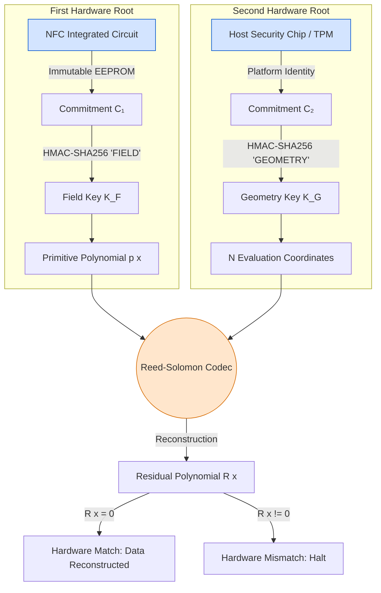

> ## ⚠ CORRECTION NOTICE — read before submitting to the IPR cell
>
> This draft was audited against the code (see `SECURITY.md`). The following statements below are
> **not true of the current prototype** and must be removed, reworded, or implemented before filing:
>
> | Draft says | Code actually does |
> |---|---|
> | "No key exists anywhere" | An AES-256-GCM key exists, derived by HKDF from a per-vault secret. |
> | NFC chip (C₁) defines the field polynomial | The polynomial is now selected from the 16 primitive polynomials by an HKDF of the vault secret — **not by the NFC chip**. |
> | TPM / host security chip (C₂) defines the evaluation points | **No TPM code exists.** Points come from the same HKDF. The optional "platform secret" is an OS-keychain value (or TPM2 on Linux, untested), used to wrap local identity keys, not shards. |
> | "Write-locked, immutable EEPROM" / "manufacturer originality signature" | The prototype uses a MIFARE Classic block with the default key; nothing is write-locked and no signature is verified. |
> | "Prototype built" for the TPM row in the hardware table | Not built. |
> | Erasure-code structure is the security boundary | Confidentiality is AES-GCM. The keyed field/points are obfuscation only. |
>
> Only claim what `SECURITY.md` supports. The regenerated PDF/TXT copies of this file are stale until re-exported.

# ANSX Vault — Invention Disclosure Summary
### For Submission to College Patent / IPR Cell

---

**Title of Invention:**
Hardware-Instantiated Erasure Coding Apparatus with Split-Authority Codec Instantiation

**Inventor(s):**
Adarsh Narain Shukla

**Date of Disclosure:**
August 2026

**Has this invention been publicly disclosed?**
☐ Yes  ☒ No
(Public disclosure includes: published papers, conference presentations,
public GitHub repositories, social media posts, product demonstrations
to external parties)

---

## 1. Problem Statement

Current data security systems protect files using encryption keys —
digital passwords that lock and unlock data. The fundamental weakness
is that **if the key is stolen, copied, or intercepted, the attacker
gains complete access.** Keys can be extracted from memory, intercepted
during transmission, or brute-forced.

This invention eliminates the key entirely.

---

## 2. What the Invention Does (Non-Technical Summary)

This invention breaks a file into mathematical fragments using
Reed-Solomon erasure coding — the same mathematics used in CDs, QR
codes, and satellite communications.

Normally, anyone who knows the math rules can reassemble those
fragments. This invention **ties the math rules themselves to two
physical hardware chips:**

- **Chip 1 (a contactless NFC card):** Determines *which version of
  the math* is used (the algebraic field structure)
- **Chip 2 (the computer's built-in security chip):** Determines
  *where in the math* the fragments are placed (the evaluation
  coordinates)

**If either chip is missing or wrong, the math itself produces
nonsense.** There is no password to steal. The algebra required to
rebuild the file does not exist without both physical chips present.

---

## 3. What Makes This Novel (Why No One Has Done This Before)

Prior systems use hardware (NFC cards, TPM chips) to **derive a
cryptographic key**, then use that key to lock/unlock data processed
by a standard, fixed Reed-Solomon codec.

This invention does something fundamentally different: the hardware
**defines the algebraic structure of the codec itself.** The
Reed-Solomon code literally cannot exist without the hardware. There
is no separate key. The hardware IS the math.

Specifically, the novelty is:

| What | Prior Art | This Invention |
|---|---|---|
| Role of hardware | Generates a key | Defines the algebra |
| Reed-Solomon codec | Fixed, standard | Changes per hardware pair |
| What an attacker needs | The key | Both physical chips simultaneously |
| Key storage | Key exists somewhere | No key exists anywhere |

---

## 4. How It Works (Technical Summary)

### Architecture: Split-Authority Codec Instantiation

The system uses two independent hardware-rooted commitment values:

**C₁ (from the NFC card):**
- Stored in write-locked, physically immutable EEPROM memory
- Determines the **primitive polynomial** of the Galois Field
- This sets the rules of how all arithmetic (addition, multiplication)
  works inside the codec
- Uses domain-separated derivation: K_F = HMAC-SHA256(C₁, "FIELD")

**C₂ (from the host computer's security chip):**
- Derived from hardware-rooted platform identity
- Determines the **evaluation x-coordinates** of the Reed-Solomon code
- This sets where on the mathematical curve each data fragment sits
- Uses domain-separated derivation: K_G = HMAC-SHA256(C₂, "GEOMETRY")

### Why Both Are Required

| Scenario | What Happens |
|---|---|
| Correct NFC + Correct Computer | Math solves perfectly. File rebuilds. |
| Wrong NFC card | Wrong field structure. All arithmetic produces wrong symbols. |
| Wrong computer | Wrong coordinates. Cannot construct the Vandermonde matrix. |
| No NFC card | Field structure unknown. Codec cannot be instantiated. |
| No computer chip | Coordinates unknown. Codec cannot be instantiated. |

### Verification Without Keys

After reconstruction, the system computes a residual polynomial R(x).
If R(x) = 0, the hardware matched. If R(x) ≠ 0, the apparatus halts
and reports a hardware mismatch. No stored password or key is consulted.

---

## 5. Hardware Components Used

| Component | Role | Status |
|---|---|---|
| NFC integrated circuit with manufacturer originality signature | First hardware root (C₁) | Prototype built |
| Host platform security chip (TPM or equivalent) | Second hardware root (C₂) | Prototype built |
| Arduino/PN532 NFC reader | Hardware bridge for NFC communication | Prototype built |
| Reed-Solomon shatter engine (C++ implementation) | Codec execution | Prototype built |
| PyQt6 desktop application | User interface | Prototype built |

---

## 6. Current State of Development

- ☒ Concept / idea stage
- ☒ Working prototype / proof of concept
- ☐ Published paper
- ☐ Product in market

**Prototype details:**
A working desktop application (A.N.Sx Vault) exists with:
- NFC card reading via Arduino hardware bridge
- Reed-Solomon shatter engine (C++ compiled library)
- Cloud shard distribution to GoFile.io
- Blockchain session management via Polygon smart contracts
- Multi-user operator support with hardware lock screen

---

## 7. Potential Commercial Applications

| Market | Application | Value |
|---|---|---|
| Enterprise security | Zero-trust physical file vaults for corporate data | High |
| Defense / military | Two-person physical data reconstruction without key transmission | Very high |
| Cryptocurrency | Hardware cold storage without seed phrases | High |
| Healthcare | Patient data that requires physical device co-presence | Medium |
| Legal / compliance | Tamper-evident document storage with hardware attestation | Medium |

---

## 8. Filing Strategy Recommendation

**Jurisdiction:** India (provisional) → PCT → India + US national phase

**Rationale:**
- Indian provisional secures global priority date at minimal cost
- PCT provides 30 months before national phase entry
- International Search Report identifies prior art before commitment
- India: apparatus framing defends against Section 3(k)
- US: specific hardware integration defends against Alice/Mayo

**Claim structure:** 1 independent claim (genus-level) + 7 dependent
claims covering specific embodiments

---

## 9. Known Prior Art

| Reference | What It Covers | Why This Invention Is Different |
|---|---|---|
| US6385751B1 | Configurable primitive polynomial in RS apparatus | Software-configurable; this invention is hardware-rooted and not software-modifiable |
| Suh & Devadas 2007 | PUF + error correcting codes | Uses hardware for key derivation, not for defining codec algebraic structure |
| McEliece 1978 | Secret code structure as cryptographic primitive | Theoretical; no physical hardware binding or split-authority architecture |
| NXP NFC authentication patents | NFC originality signatures | Authentication only; not used for codec parameterization |

---

## 10. Attachments

The following documents accompany this disclosure:

1. **Draft Claims Document** — 1 independent + 7 dependent claims
   (reviewed by four independent technical reviewers)
2. **Engineering Tasks Document** — Hardware BOM template,
   co-presence protocol, deterministic mappings
3. **Specification Sections** — Probability analysis, prior art
   distinction, Section 3(k) defense arguments
4. **Working Prototype** — Available for demonstration
