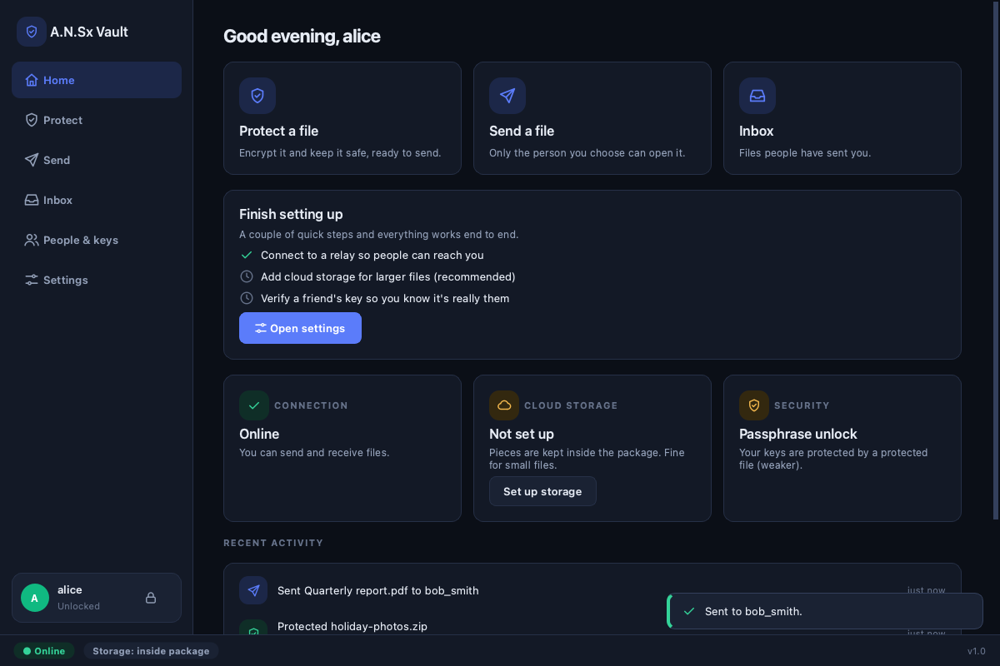
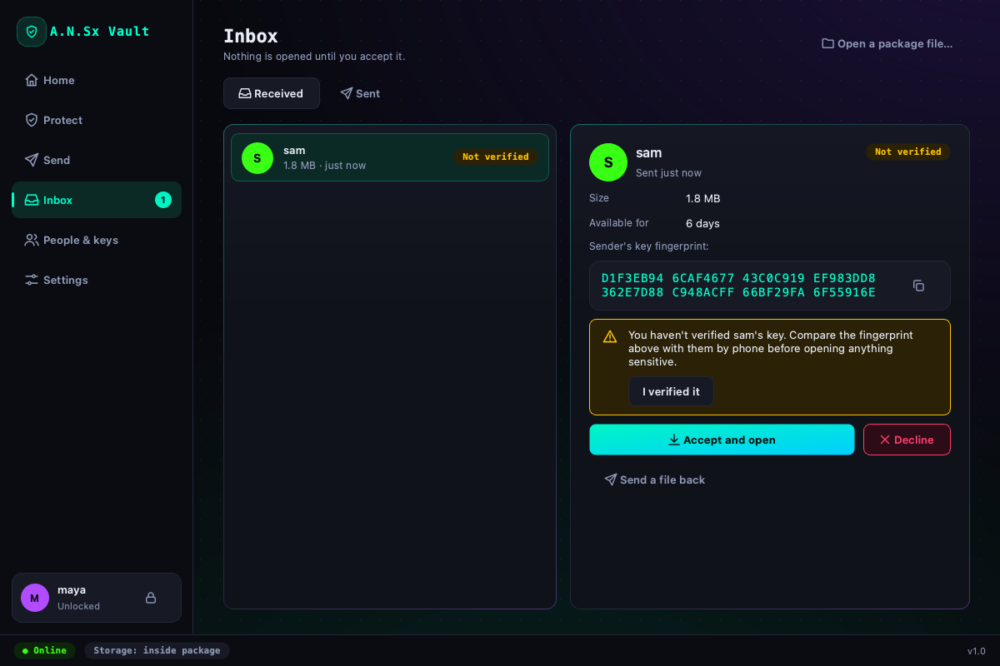
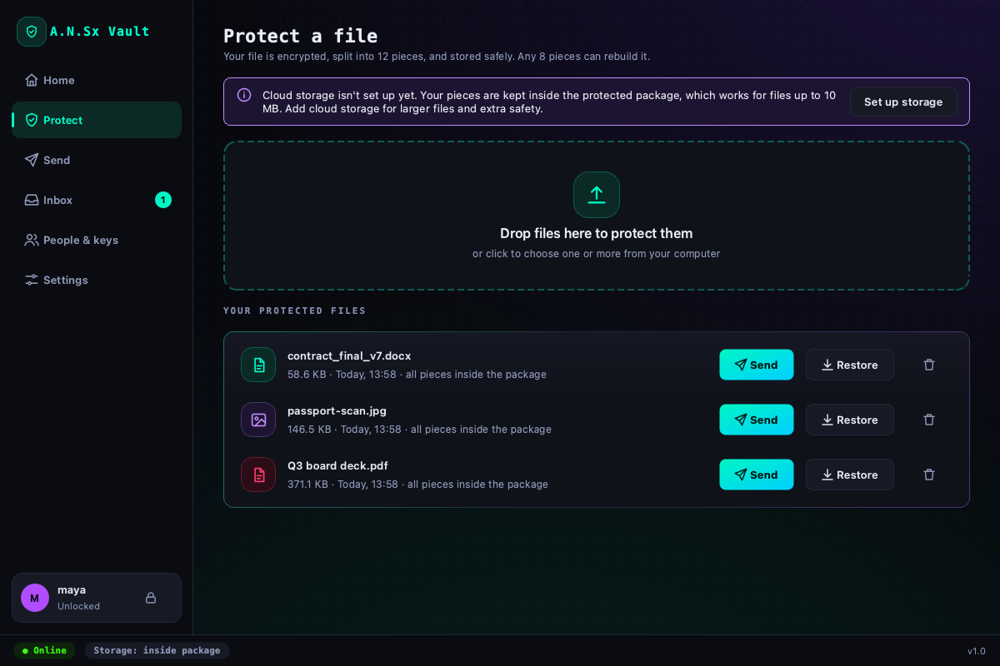
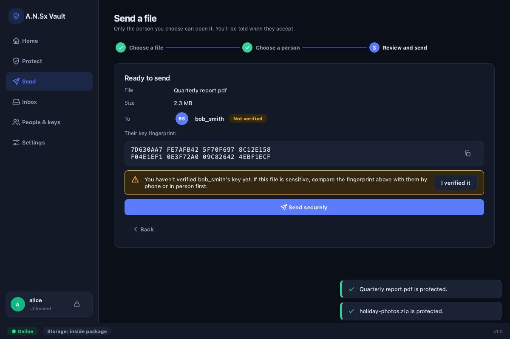

# A.N.Sx Vault

**Send files that only the right person can open.** Your file is encrypted on your computer, split into
12 pieces (any 8 rebuild it), stored across your own cloud accounts, and delivered through a relay that
can never read it. The receiver decides whether to accept, and can check that the sender really is who they claim.

<p align="center">
  
  
</p>
<p align="center">
  
  
</p>

## What it does

| | |
|---|---|
| **Protect** | Drag a file in. It is compressed, encrypted (AES-256-GCM), split with Reed-Solomon (12 pieces, any 8 rebuild it) and stored in your cloud buckets. |
| **Send** | Three steps: choose file, choose person, review. Only the receiver's key can open it. Interrupted uploads pick up where they stopped. |
| **Receive** | New files appear in your inbox with the sender's key status. Nothing opens until you accept. Downloads resume, are hash-checked, and land in `Downloads/A.N.Sx Vault`. |
| **Trust** | People are identified by a key fingerprint. Compare it by phone once and the app warns you if a key ever changes. |
| **Unlock** | An NFC card (Arduino + PN532) or a passphrase. Keys are encrypted at rest and locked automatically when idle. |
| **Everywhere** | Written to run on Windows, macOS and Linux (developed and tested on macOS). Dark and light themes. |

## Quick start

```bash
pip install -r requirements.txt
python build_engine.py                                   # builds the native encryption engine for this OS
python run_relay.py --tunnel                            # a relay + free public https address (needs cloudflared)
                                                         # or --tailscale for a permanent address (needs Tailscale Funnel)
python main.py                                           # then: Settings → Cloud storage to add your buckets
```

Check any installation with `python main.py --self-test`. On first launch the app walks you through creating your identity. To use cloud storage or a shared relay, open
**Settings**: it has guided setup for Cloudflare R2, Backblaze B2 and Amazon S3, with a **Test connection** button.

Full step-by-step instructions, including deploying the relay and a two-person test: **[SETUP.md](SETUP.md)**.
What is and isn't protected, and known limits: **[SECURITY.md](SECURITY.md)**.

## Project layout

```
main.py                 application entry point
ui/                     the desktop app (PyQt6): theme, icons, widgets, pages, controller
  controller.py         all app logic and background jobs; pages only display state
  pages/                home, protect, send, inbox, people & keys, settings, sign-in
vault_service.py        protect / re-wrap / reconstruct (no GUI code)
engine.py + shatter_engine.cpp   native AES-GCM + Reed-Solomon engine (portable C++17)
security_core.py        identities, key protection, contacts and key pinning
ghost_map.py, courier.py         encrypted "secure package" and shard retrieval
cloud_dispatcher.py     S3-compatible storage (R2, B2, S3, MinIO ...)
relay/                  the relay server (directory + resumable mailbox), with Dockerfile
relay_client.py         signed, resumable client for the relay
tests/                  unit, integration and full-UI tests (real relay, real window)
```

## Development

```bash
pip install -r requirements-dev.txt
python -m pytest tests -q        # ~2 min: engine, relay, service layer, contracts, and the full UI
```

The UI tests drive the real window offscreen against a live relay: onboarding, login errors, protect, send,
receive, verification, settings, theme and auto-lock.
